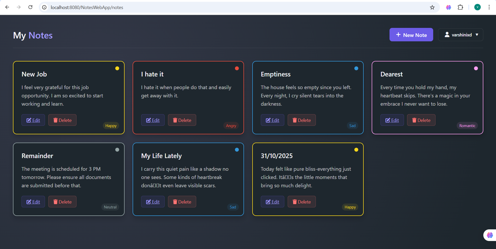

# Notes Application with Mood Detection


A Java web application that lets users create, organize, and visualize notes by emotional tone through color-coding.

## 📸 Screenshots

### 🧍‍♀️ Signup Page


### 🧾 Dashboard / Notes Page


## ✨ Key Features

- **User Authentication**: Secure login/signup with session management
- **Mood-Based Visualization**: 
  - Notes automatically colored by mood (happy, angry, sad, romantic)
  - Rule-based detection using keyword analysis
- **Full CRUD Operations**: Create, Read, Update, and Delete notes
- **Responsive UI**: Clean dark-themed interface with CSS Grid/Flexbox

## 🛠️ Tech Stack

**Backend**:
- Java 17+
- Jakarta Servlet 5.0
- MySQL 8.0

**Frontend**:
- JSP (JavaServer Pages)
- CSS3 with variables
- Font Awesome icons

## 🎨 Mood Detection Logic

```java
// Sample mood detection
public String detectMood(String text) {
    text = text.toLowerCase();
    
    if (text.contains("happy") || text.contains("joy")) 
        return "happy"; // Yellow
    else if (text.contains("angry") || text.contains("mad")) 
        return "angry"; // Red
    // ... other mood checks
}
